# Introducción al problema

Cuando un modelo de *machine learning* muestra una curva de equity bonita en un backtest, casi siempre toca hacerse la pregunta incómoda: ¿De verdad encontró señal predictiva, o nomás memorizó ruido? El sobreajuste explica por qué tantos sistemas que parecen rentables en papel acaban quemando capital apenas se les pone dinero real.

El problema de fondo es viejo. Con suficientes parámetros y suficientes intentos, cualquier modelo aprende los accidentes históricos del precio y produce métricas espectaculares dentro de muestra. La pregunta útil no es "¿Gana dinero en backtest?", sino "¿Gana significativamente más de lo que ganaría un sistema sin señal sobre datos sin información predictiva?". Esa segunda pregunta es la que ataca el Monte Carlo Permutation Test (MCPT) que describe Timothy Masters en *Testing and Tuning Market Trading Systems*.

## Objetivo y pregunta de investigación

Este reporte no busca construir el mejor sistema de trading sobre el S&P 500. Es un trabajo de calibración metodológica, y la pregunta es una sola:

> ¿El MCPT discrimina entre modelos con señal genuina y modelos que sólo memorizan ruido, cuando lo corremos sobre un activo real como SPY?

Para contestar, armamos un experimento con tres modelos donde sabemos *a priori* qué debería pasar:

1. **Oráculo con ruido**: ve el target real y le suma ruido gaussiano. Por construcción tiene señal.
2. **LightGBM overfit**: gradient boosting con muchas features técnicas. Por construcción debería overfittear in-sample y fallar walk-forward.
3. **Random puro**: tira una moneda. Por construcción no tiene señal.

Si el MCPT está bien calibrado, vamos a ver p-values bajos para el oráculo (señal real), p-values bajos in-sample pero altos walk-forward para el LGBM (overfitting clásico) y p-values más o menos uniformes para el random.

## Preguntas específicas

1. ¿El MCPT in-sample detecta sobreajuste? (LGBM: p-IS bajo, p-WF alto.)
2. ¿El MCPT walk-forward detecta sistemas genuinos? (Oráculo: p-WF bajo.)
3. Bajo la hipótesis nula, ¿El p-value es uniforme? (Random: p ≈ U[0,1].)
4. ¿Cómo se contamina el test cuando las features están correlacionadas con la magnitud del retorno? (LGBM vs LGBM clean.)

# Marco teórico

## El test de permutación de Monte Carlo (MCPT)

El MCPT (Masters, capítulo 7) es un test de hipótesis no paramétrico. La lógica es directa:

::: {.callout-note title="Hipótesis nula del MCPT"}
$H_0$: el modelo es inútil. No hay relación entre las features $X$ y el target $y$, y cualquier desempeño positivo se debe al azar.
:::

La receta operativa:

1. Calcular el desempeño real del sistema con los datos en su orden original. A ese valor le llamamos $\theta_{\text{real}}$.
2. Permutar los datos de modo que se destruya la relación predictiva entre $X$ y $y$, sin tocar las distribuciones marginales ni las dependencias internas de $X$.
3. Correr otra vez el sistema sobre los datos permutados y medir $\theta^{(j)}$.
4. Repetir $m$ veces (cientos o miles).
5. Comparar $\theta_{\text{real}}$ contra la distribución $\{\theta^{(1)}, \dots, \theta^{(m)}\}$.

El p-value se calcula como:

$$
p\text{-value} = \frac{k+1}{m+1}, \quad k = \#\{j : \theta^{(j)} \geq \theta_{\text{real}}\}
$$

El "+1" en numerador y denominador es la corrección de Masters: la corrida original cuenta como una observación válida bajo $H_0$. Si $\theta_{\text{real}}$ cae a la derecha de casi todas las permutaciones, $k$ es chico y el p-value también, lo que se lee como evidencia de señal genuina.

## ¿Qué permutar y por qué? (la decisión más importante)

Aquí se gana o se pierde el experimento, y no en vano Masters le dedica buena parte del capítulo. Existen dos estrategias grandes.

### Permutación de precios (Masters)

Sirve para sistemas de trading que miran la historia de precios y toman decisiones de long/short. Se deconstruye el precio en cambios (log-returns), se barajan esos cambios y se reconstruye una historia sintética manteniendo el precio inicial y final (así no se altera la tendencia). El sistema se re-entrena sobre ese "mercado sintético".

### Permutación del target — *Y-permutation* (Masters)

Sirve para modelos predictivos donde tenemos pares $(X_t, y_t)$ y queremos romper el link entre features y target sin tocar la estructura interna de $X$. Es nuestro caso: features técnicas sobre SPY para predecir el signo del retorno del día siguiente.

En este trabajo usamos Y-permutation. La justificación de Masters es:

> "Indicator sets must not permute with respect to one another, only with respect to the target. This preserves intraset correlation, which is critical to correct testing." (Masters)

Dicho en cristiano: si las features son las medias móviles de 10, 20 y 50 días, más la volatilidad realizada, todas esas series están correlacionadas entre sí en el tiempo real. Permutarlas por separado generaría combinaciones que el mercado real no produce (por ejemplo, volatilidad muy alta con todas las medias móviles planas). El MCPT pide que las permutaciones tengan la misma probabilidad de ocurrir bajo $H_0$ que en la realidad, y permutar features de forma independiente rompe esa propiedad.

La opción limpia es dejar $X$ intacto y barajar sólo $y$, junto con los retornos $r$ que sirven para evaluar PnL. Así rompemos el emparejamiento $X_t \to y_t$ sin contaminar la estructura interna de $X$.

### El problema oculto: correlación serial en target y features

Masters avisa de un segundo problema:

> "Serial correlation in just one or more predictor variables, or in just the target, is harmless. […] But if both are serially correlated, permutation will destroy this property, and we will be in the situation of processing pairings that could not occur in real life."

Las features técnicas (medias móviles, volatilidades realizadas) son fuertemente autocorrelacionadas: el valor en $t$ y en $t-1$ son casi idénticos. Si el target o el retorno también lo fueran, el MCPT se rompe.

En nuestro caso el target es el signo del log-return diario, cuya autocorrelación es prácticamente nula (consistente con la hipótesis de eficiencia débil). El problema más fino es otro. Algunas features están correlacionadas con la magnitud del retorno futuro. Por ejemplo, la volatilidad realizada predice qué tan grande va a ser el próximo movimiento, aunque no diga en qué dirección. Eso le da una ventaja sutil a la corrida real, porque el modelo "sabe cuándo" los retornos son grandes incluso si no sabe el signo.

Para medir el tamaño de ese sesgo, entrenamos LightGBM en dos configuraciones:

- **LGBM (full)**: con las 27 features técnicas.
- **LGBM clean**: sólo con `open, high, low, close` crudos (4 columnas), donde la correlación con $|r_{t+1}|$ es mínima.

La diferencia entre los dos p-values aísla el sesgo que meten las features correlacionadas con la magnitud.

## Walk-forward vs in-sample

Masters distingue tres usos del MCPT:

1. *Testing a fully specified system* sobre datos OOS.
2. *Testing the training process*, con foco en detectar overfitting (in-sample).
3. *Testing a model factory* (walk-forward).

Acá corremos los dos extremos:

- **MCPT in-sample**: entrenamos el modelo sobre todos los datos y medimos el Profit Factor (PF) in-sample. Bajo $H_0$ permutamos $y$ y volvemos a entrenar. El test detecta overfitting así: si el modelo está sobreajustado, su PF en la corrida real va a ser altísimo, pero también lo va a ser en las permutaciones (porque sigue memorizando el ruido nuevo), y por eso el p-value sale alto.

  > "An overfitted trading system will perform well not only on the original data but on permuted data as well. […] All in-sample performances, permuted and unpermuted, will be excellent, and the original performance will not stand out from its permuted competitors." (Masters)

- **MCPT walk-forward (WF)**: en cada fold entrenamos con la ventana de los últimos 8 años y predecimos los próximos 3 (re-entrenando cada 756 días). Concatenamos todas las predicciones OOS y medimos PF. Bajo $H_0$ permutamos $y$ y los retornos en el rango OOS conjunto una sola vez por corrida, y volvemos a hacer todo el walk-forward.

  Masters subraya aquí una regla: la primera ventana de training nunca aparece en OOS en la corrida real, así que tampoco debe permutarse hacia adentro del OOS de las permutaciones.

## ¿Qué es exactamente un *sliding walk-forward*?

El walk-forward es la forma honesta de evaluar un modelo en series de tiempo. En *machine learning* clásico uno reparte los datos al azar en train/test, pero en finanzas no se puede: si entrenamos con 2020 y testeamos con 2010, estaríamos usando el futuro para predecir el pasado (*look-ahead bias*), y cualquier modelo se vería artificialmente bueno.

El walk-forward respeta el orden temporal. Existen dos variantes:

- **Anclado (*anchored*)**: la ventana de training crece con el tiempo. Arranca en el primer dato y se extiende hasta el momento actual. El modelo "recuerda" toda la historia.
- **Deslizante (*sliding* o *rolling*)**: la ventana de training tiene tamaño fijo y se desliza hacia adelante. El modelo "olvida" datos viejos y se entrena siempre sobre las últimas N observaciones.

Optamos por sliding walk-forward. El mercado tiene memoria limitada: los regímenes, las volatilidades y las correlaciones cambian con los años, y entrenar sobre una ventana móvil hace que el modelo se adapte a las condiciones recientes en lugar de arrastrar regímenes obsoletos.

### Esquema visual

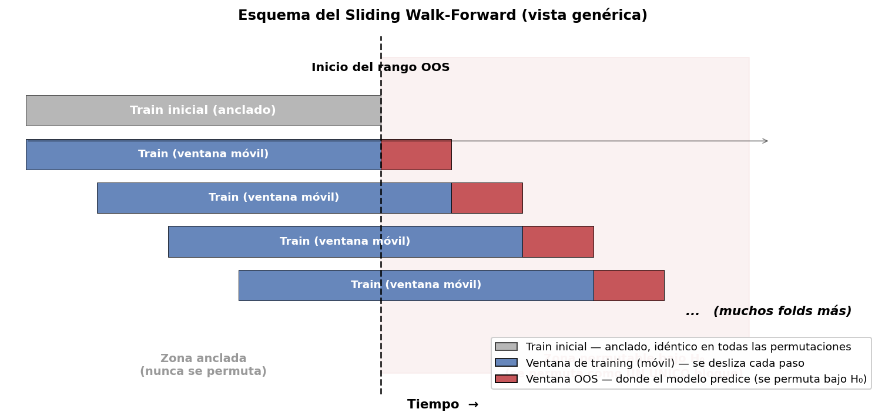{#fig-sliding-wf}

Cada fold tiene:

1. Una ventana de training de tamaño fijo (azul) sobre las observaciones más recientes hasta ese momento.
2. Una ventana OOS inmediatamente posterior (rojo), donde el modelo predice sin haber visto esos datos.
3. Entre fold y fold, ambas ventanas se desplazan juntas.
4. Las predicciones de todas las ventanas OOS se concatenan en una sola serie continua. Sobre esa serie calculamos el Profit Factor final.

En nuestro experimento sobre SPY, con ventana de training de 8 años y ventana OOS de 3 años sobre unos 26 años de datos, salen exactamente 6 folds OOS: cinco folds completos de 3 años más uno final de aproximadamente 2.5 años, porque el rango OOS total ronda los 17.5 años. Cada fold re-entrena el modelo desde cero sobre su ventana; no hay *online learning* ni transferencia entre folds. Elegimos folds OOS largos (3 años) en lugar de cortos (3 meses) porque el test queda más exigente: el modelo tiene que generalizar lejos de su training set, y se parece más a la práctica real de un sistema que se re-entrena cada cierto tiempo en lugar de cada trimestre.

::: {.callout-note title="Qué se permuta en walk-forward"}
En el diagrama, sólo se permuta la zona roja: el rango OOS conjunto a partir del final del train inicial.

- Zona gris (train inicial): anclada. No se toca. Es idéntica en la corrida real y en todas las permutaciones.
- Zona roja (todo el OOS): bajo $H_0$ permutamos el par $(y, r)$ con un único índice aleatorio sobre todo ese rango, de una vez. Después el walk-forward corre normalmente sobre el dataset resultante: las ventanas de training móviles van pasando por encima del rango permutado y re-entrenando con $y$ barajado.
:::

### ¿Por qué exactamente así?

Hay dos detalles importantes.

1. **El train inicial queda anclado.** En la corrida real, esos primeros datos sólo aparecen como *training* del primer fold; no entran como ventana OOS en ningún fold. Si los permutáramos, podrían colarse dentro de una ventana OOS bajo $H_0$ e inyectar observaciones (un *crash*, una racha de alta volatilidad) que no estaban en la corrida real, y la comparación dejaría de ser *apples-to-apples*.

2. **Todo el rango OOS se permuta como un solo bloque.** Permutar cada fold por separado es la alternativa obvia, pero destruye la estructura temporal de largo plazo (tendencia, *volatility clustering*, autocorrelación) del rango OOS y trata a cada fold como un universo independiente. Permutar el bloque completo preserva esa estructura.

En términos de código, esto se traduce en un solo `permutation` del par $(y, r)$ sobre el rango OOS, seguido del walk-forward normal:

```python
def _wf_one_perm(seed, model_name, X, y, log_ret):
    # 1) Copiamos y, ret. Pre-OOS queda igual (zona gris).
    y_used   = y.copy()
    ret_used = log_ret.copy()

    # 2) Permutamos el rango OOS conjunto (zona roja) con UN ÚNICO índice.
    #    y_used[t] y ret_used[t] se mantienen emparejados entre sí.
    rng = np.random.default_rng(seed)
    idx = rng.permutation(len(y) - TRAIN_WINDOW)
    y_used.iloc[TRAIN_WINDOW:]   = y.iloc[TRAIN_WINDOW:].values[idx]
    ret_used.iloc[TRAIN_WINDOW:] = log_ret.iloc[TRAIN_WINDOW:].values[idx]

    # 3) Walk-forward normal sobre el dataset semi-permutado.
    sig, ret = _wf_one(model_name, X, y, log_ret, y_used, ret_used)

    # 4) PF sólo sobre el rango OOS.
    sig_oos = sig.iloc[TRAIN_WINDOW:]
    ret_oos = ret.iloc[TRAIN_WINDOW:]
    return profit_factor(sig_oos, ret_oos)
```

Lo que importa no es el modelo ni cuántos folds resultan, sino qué se permuta y qué no. El train inicial queda intacto (zona gris) y el rango OOS se baraja como un solo bloque (zona roja). Esa disciplina es lo que vuelve honesto al test.

## Estadístico: Profit Factor

Para evaluar las señales usamos el Profit Factor (PF):

$$
\text{PF} = \frac{\sum_{t : \text{PnL}_t > 0} \text{PnL}_t}{\left|\sum_{t : \text{PnL}_t < 0} \text{PnL}_t\right|},
\quad \text{PnL}_t = \text{signal}_t \cdot r_{t+1}
$$

Es la razón entre dólares ganados y dólares perdidos. Por construcción, $\text{PF} > 1$ es rentable, $\text{PF} = 1$ es *break-even* y $\text{PF} < 1$ es perdedor. Lo usamos porque es robusto a outliers y mide calidad económica, no sólo dirección.

# Metodología y simulación

## Datos

- **Activo**: SPY (proxy del S&P 500), descargado de Yahoo Finance.
- **Período**: 2000-01-03 a 2026-05-15.
- **Frecuencia**: diaria.
- **Total**: 6,632 barras OHLCV crudas; 6,432 filas tras construir features (descartamos lookbacks largos).
- **Target**: $y_t = \text{sign}(r_{t+1})$, donde $r_{t+1} = \log(P_{t+1}) - \log(P_t)$. Reemplazamos los ceros por $+1$ (raro en daily data).
- **Balance**: 55% long, 45% short (consistente con el drift positivo del SPY).

## Features

Armamos un set amplio (27 features) para que LightGBM tenga capacidad de sobra para overfittear:

```python
def build_features(ohlcv: pd.DataFrame):
    df = pd.DataFrame(index=ohlcv.index)
    close, open_, high, low, vol = (
        ohlcv['Close'], ohlcv['Open'], ohlcv['High'], ohlcv['Low'], ohlcv['Volume']
    )
    log_close = np.log(close)
    log_ret   = log_close.diff()

    # Retornos a varios horizontes
    for n in [1, 2, 3, 5, 10, 21, 63]:
        df[f'ret_{n}d'] = log_close.diff(n)

    # Ratios sobre medias móviles
    for n in [10, 20, 50, 100, 200]:
        df[f'price_ma{n}_ratio'] = close / close.rolling(n).mean() - 1

    # Volatilidad realizada (anualizada)
    for n in [5, 10, 21, 63]:
        df[f'rvol_{n}d'] = log_ret.rolling(n).std() * np.sqrt(252)

    # Ratio de vol corta/larga, ATR normalizado
    df['vol_ratio']    = df['rvol_5d'] / (df['rvol_63d'] + 1e-9)
    tr = pd.concat([high - low,
                    (high - close.shift()).abs(),
                    (low  - close.shift()).abs()], axis=1).max(axis=1)
    df['atr_norm_14d'] = tr.rolling(14).mean() / close

    # Estructura intra-día y momentos de tercer/cuarto orden
    df['candle_body'] = (close - open_) / close
    df['gap']         = (open_ - close.shift()) / close.shift()
    df['hl_range']    = (high - low) / close
    df['rel_volume']  = vol / vol.rolling(20).mean()
    df['skew_21d']    = log_ret.rolling(21).skew()
    df['kurt_21d']    = log_ret.rolling(21).kurt()
    df['skew_63d']    = log_ret.rolling(63).skew()

    # Calendario
    df['day_of_week'] = ohlcv.index.dayofweek.astype(float)
    df['month']       = ohlcv.index.month.astype(float)

    target = np.sign(log_close.shift(-1) - log_close).replace(0, 1)
    df['_target'] = target
    df = df.dropna()
    return df.drop(columns=['_target']), df['_target']
```

Aparte, definimos `X_is` con sólo `open, high, low, close` crudos. Esa variante se usa en el experimento de **LGBM clean**, que aísla el efecto de las features correlacionadas con la magnitud del retorno:

```python
X_is = pd.DataFrame({
    'open':  spy['Open'], 'high':  spy['High'],
    'low':   spy['Low'],  'close': spy['Close'],
}, index=spy.index).reindex(X_full.index)
```

## Los tres modelos

Los tres modelos exponen la misma interfaz: dado $X$ (y, en su caso, $y$ para entrenar), devuelven una `Series` de señales en $\{-1, +1\}$.

```python
def predict_oracle(y_true, seed, noise_std=ORACLE_NOISE):
    """Modelo 1 — Oráculo: ve la y real, le suma ruido gaussiano, devuelve el signo.
    Con ORACLE_NOISE = 1.0 da señal moderada (PF ≈ 5)."""
    rng = np.random.default_rng(seed)
    noise = rng.normal(0, noise_std, size=len(y_true))
    return pd.Series(np.sign(y_true.values + noise),
                     index=y_true.index).replace(0, 1)

def train_lgbm(X, y):
    """Modelo 2 — LightGBM con capacidad suficiente para memorizar ruido."""
    y_bin = ((y.values + 1) / 2).astype(int)
    m = LGBMClassifier(num_leaves=31, min_child_samples=20,
                       learning_rate=0.05, n_estimators=200,
                       random_state=42, n_jobs=1, verbose=-1)
    m.fit(X.values, y_bin)
    return m

def predict_random(X, seed):
    """Modelo 3 — Random: moneda al aire. Control negativo."""
    rng = np.random.default_rng(seed)
    return pd.Series(rng.choice([-1.0, 1.0], size=len(X)), index=X.index)

def profit_factor(signal, log_ret):
    pnl = signal.values * log_ret.values
    pnl = pnl[~np.isnan(pnl)]
    wins = pnl[pnl > 0].sum()
    loss = np.abs(pnl[pnl < 0].sum())
    return wins / loss if loss > 1e-10 else float('inf')
```

## Parámetros de simulación

| Parámetro | Valor | Comentario |
|---|---|---|
| `N_PERM` (IS) | 1,000 | Permutaciones por modelo in-sample |
| `N_PERM` (WF) | 1,000 | Permutaciones por modelo walk-forward |
| `TRAIN_WINDOW` | 2,016 días ($\approx$ 8 años) | Ventana de training para cada fold WF |
| `WF_STEP` | 756 días ($\approx$ 3 años) | Tamaño de la ventana OOS / frecuencia de re-entrenamiento (resulta en 6 folds OOS) |
| `ORACLE_NOISE` | 1.0 | Std del ruido gaussiano en el oráculo |
| `RNG_SEED` | 67 | Semilla maestra (reproducibilidad) |
| `REAL_SEED` | 7 | Semilla de la corrida real (un draw fijo) |
| `N_JOBS` | 8 | Workers paralelos (joblib/loky) |

Todas las semillas están fijadas, así que la reproducibilidad es exacta.

# Mecánica de la permutación (la parte central)

A esto le dedicamos una sección entera porque es la decisión metodológica más delicada del trabajo: si esto se hace mal, todo lo demás vale poco.

## In-sample: permutar el par $(y, r)$ con un único índice

En IS el dataset es estático. Tenemos las matrices $X$ (features), $y$ (target $\pm 1$) y $r$ (log-retornos para evaluar PnL). Bajo $H_0$ queremos romper el link $X \to (y, r)$.

La regla de oro es permutar $y$ y $r$ con el mismo índice. La razón es que $y_t = \text{sign}(r_{t+1})$: si los barajamos por separado, esa identidad se rompe y aparecen targets imposibles dados los retornos. Mantener el par junto preserva la coherencia interna del "mundo permutado".

```python
def _permute_pair(y, ret, seed):
    """Permuta y y ret con el MISMO índice aleatorio.
    Resultado: y_perm[t] y ret_perm[t] siguen emparejados entre sí,
    pero desalineados del X[t] original. Eso rompe X -> (y, ret)
    sin contaminar la coherencia interna del par."""
    rng      = np.random.default_rng(seed)
    idx      = rng.permutation(len(y))
    y_perm   = pd.Series(y.values[idx],   index=y.index)
    ret_perm = pd.Series(ret.values[idx], index=ret.index)
    return y_perm, ret_perm
```

Para cada modelo, una permutación implica cosas distintas:

| Modelo | Qué pasa bajo permutación |
|---|---|
| Oráculo | Usa la $y$ real (no permutada) para generar su señal, pero la señal se evalúa contra `ret_perm`. Lo esperado es que el PF colapse a $\approx 1$, porque la señal "correcta" se aplica a retornos reordenados al azar. |
| LGBM | Se re-entrena sobre $(X, y_{\text{perm}})$ y predice sobre $X$. La señal se evalúa contra `ret_perm`. Si LGBM tiene capacidad de sobra, va a memorizar la $y$ permutada y producir un PF alto. Justo lo que queremos detectar como overfitting. |
| Random | Ignora todo. Señal aleatoria evaluada contra `ret_perm`. La distribución bajo $H_0$ queda centrada en PF = 1. |

```python
def run_is_mcpt(model_name, X, y, log_ret, n_perm, n_jobs, real_seed):
    def _signal(y_for_training, seed):
        if model_name == 'oracle':
            return predict_oracle(y, seed=seed)              # oráculo SIEMPRE ve y real
        elif model_name in ('lgbm', 'lgbm_clean'):
            return predict_lgbm(train_lgbm(X, y_for_training), X)
        elif model_name == 'random':
            return predict_random(X, seed=seed)

    def _one_perm(seed):
        y_perm, ret_perm = _permute_pair(y, log_ret, seed)
        sig   = _signal(y_perm, seed)
        pf    = profit_factor(sig, ret_perm)
        return pf

    # Corrida real: nada permutado
    sig_real = _signal(y, real_seed)
    real_pf  = profit_factor(sig_real, log_ret)

    # m permutaciones en paralelo
    perm_pfs = Parallel(n_jobs=n_jobs, backend='loky')(
        delayed(_one_perm)(s) for s in range(1, n_perm + 1)
    )
    perm_pfs = np.array([pf for pf in perm_pfs if np.isfinite(pf)])

    k     = int((perm_pfs >= real_pf).sum())
    p_val = (k + 1) / (len(perm_pfs) + 1)        # fórmula de Masters
    return {'real_pf': real_pf, 'perm_pfs': perm_pfs, 'p_value': p_val}
```

## Walk-forward: una sola permutación por corrida, sobre el rango OOS

La cosa se afina aquí. Masters lo dice claro: en walk-forward la primera ventana de training no aparece en OOS en la corrida real, así que no debe permutarse hacia adentro del rango OOS de las permutaciones; si lo hiciéramos, podríamos inyectar datos atípicos (un *crash*, un periodo de alta volatilidad) que distorsionan la comparación.

Nuestra estrategia es la que Masters llama "do a single permutation of all market changes after the first training fold":

1. Pre-OOS (primeras 2,016 barras, aproximadamente del 2000-01-03 al 2008-01-04): no se permuta. Es el train inicial, y la curva de equity en esa zona es idéntica en todas las permutaciones.
2. OOS conjunto (todo lo que viene después): se permuta una sola vez por corrida, con un único índice aleatorio, manteniendo $y$ y $r$ emparejados.
3. Sobre el dataset resultante, corremos el walk-forward normalmente: ventana móvil de 8 años, re-entrenando cada 3 años (6 folds en total).

```python
def _wf_one_perm(seed, model_name, X, y, log_ret):
    # 1) Copiamos y, ret. Pre-OOS queda igual.
    y_used   = y.copy()
    ret_used = log_ret.copy()

    # 2) Permutamos el rango OOS conjunto con un ÚNICO índice
    rng   = np.random.default_rng(seed)
    idx   = rng.permutation(len(y) - TRAIN_WINDOW)
    y_oos = y.iloc[TRAIN_WINDOW:].values[idx]
    r_oos = log_ret.iloc[TRAIN_WINDOW:].values[idx]
    y_used.iloc[TRAIN_WINDOW:]   = y_oos
    ret_used.iloc[TRAIN_WINDOW:] = r_oos

    # 3) Walk-forward normal sobre el dataset semi-permutado
    sig, ret = _wf_one(model_name, X, y, log_ret, y_used, ret_used)

    # PF sólo sobre el OOS
    sig_oos = sig.iloc[TRAIN_WINDOW:]
    ret_oos = ret.iloc[TRAIN_WINDOW:]
    valid   = ret_oos.notna()
    pf      = profit_factor(sig_oos[valid], ret_oos[valid])
    return pf
```

Dentro de cada fold walk-forward, el modelo se entrena con `y_used` (eventualmente permutada) y se evalúa contra `ret_used` (permutado de forma consistente). Eso rompe el link $X \to (y, r)$ sólo dentro del rango OOS. La parte pre-OOS hace de anclaje común para todas las trayectorias.

```python
def _wf_one(model_name, X, y, log_ret, y_used, ret_used, real_seed=REAL_SEED):
    n        = len(X)
    signals  = []; rets_eval = []

    # Train inicial (común a todas las permutaciones)
    X_init       = X.iloc[:TRAIN_WINDOW]
    y_init_real  = y.iloc[:TRAIN_WINDOW]
    y_init_train = y_used.iloc[:TRAIN_WINDOW]
    ret_init     = ret_used.iloc[:TRAIN_WINDOW]
    sig_init     = _wf_signal_for_window(
        model_name, X_tr=X_init, y_tr_for_training=y_init_train,
        y_real_window=y_init_real, X_win=X_init, seed=real_seed,
    )
    signals.append(sig_init); rets_eval.append(ret_init)

    # Folds OOS: 6 folds, cada uno re-entrena con su ventana de los 8 años previos
    for start in range(TRAIN_WINDOW, n, WF_STEP):
        end       = min(start + WF_STEP, n)
        X_tr      = X.iloc[start - TRAIN_WINDOW : start]
        y_tr      = y_used.iloc[start - TRAIN_WINDOW : start]
        X_te      = X.iloc[start : end]
        y_te_real = y.iloc[start : end]
        r_te      = ret_used.iloc[start : end]

        sig = _wf_signal_for_window(
            model_name, X_tr=X_tr, y_tr_for_training=y_tr,
            y_real_window=y_te_real, X_win=X_te,
            seed=real_seed + start,
        )
        signals.append(sig); rets_eval.append(r_te)

    return pd.concat(signals), pd.concat(rets_eval)
```

::: {.callout-important title="¿Por qué una sola permutación global y no una por fold?"}
Masters discute las dos alternativas: permutar todo el OOS como un único bloque, o permutar cada fold por separado. Optamos por la primera porque preserva mejor las propiedades estadísticas de largo plazo (tendencia, *vol*, autocorrelación) del rango OOS, en lugar de tratar cada fold como un universo aislado. El propio Masters lo dice así: "*Personally, I prefer to focus on market patterns that are universal […] my own habit is to permute all market changes after the first fold's training set as a single large group.*" (Masters)
:::

::: {.callout-warning title="Detalle clave: el oráculo siempre ve la y real"}
En la corrida real y en cada permutación, el oráculo recibe la $y$ verdadera (capturada vía *closure*), nunca la permutada. Su ventaja es ver el futuro con ruido y eso no cambia entre permutaciones. Lo que sí cambia es que sus señales se evalúan contra `ret_perm` (retornos desordenados), así que en las permutaciones el oráculo "acierta el signo" pero contra el retorno equivocado. Por eso el oráculo funciona como referencia de "señal verdadera" en el experimento.
:::

# Resultados e interpretación

Corrimos 1,000 permutaciones por modelo en cada test (in-sample y walk-forward), paralelizando con `joblib`. La simulación completa tomó algunas horas; la mayor parte se va en re-entrenar LGBM 1,000 veces. Los plots quedan guardados como PNG en `results/` y los cargamos a continuación.

## Tabla resumen

```python
rows = []
for name in ['oracle', 'lgbm', 'lgbm_clean', 'random']:
    rows.append({
        'Modelo'    : name,
        'PF real IS': is_results[name]['real_pf'],
        'p-value IS': is_results[name]['p_value'],
        'PF real WF': wf_results.get(name, {}).get('real_pf', np.nan),
        'p-value WF': wf_results.get(name, {}).get('p_value', np.nan),
    })
summary = pd.DataFrame(rows).set_index('Modelo')
```

| Modelo       | PF real IS | p-value IS | PF real WF | p-value WF |
|--------------|-----------:|-----------:|-----------:|-----------:|
| oracle       |     5.176  |   0.0010   |     5.390  |   0.0010   |
| lgbm         |    16.910  |   0.0440   |     1.063  |   0.2817   |
| lgbm_clean   |     1.877  |   0.0180   |        —   |        —   |
| random       |     0.963  |   0.8292   |     1.018  |   0.3407   |

## In-Sample MCPT — histogramas

### Oráculo

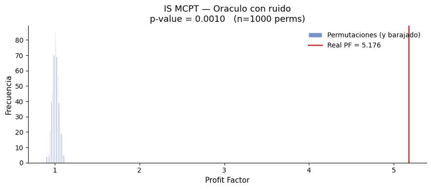{#fig-is-oracle}

El oráculo tiene una señal que pusimos nosotros a propósito. Bajo permutación, la señal sigue viendo la $y$ real pero se evalúa contra retornos reordenados al azar, así que su PF colapsa a $\approx 1$. El PF real de 5.18 queda varias desviaciones a la derecha de todo el abanico. El MCPT detecta correctamente la señal.

### LightGBM (overfit)

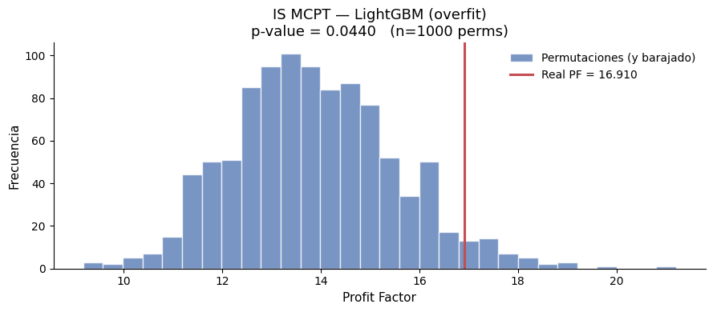{#fig-is-lgbm}

Este fue el plot que más nos sorprendió al armar el experimento. LGBM produce un PF de 16.9 sobre los datos reales y un PF promedio de 14 sobre $y$ permutadas al azar. Es Masters en acción:

> "An overfitted trading system will perform well not only on the original data but on permuted data as well. […] All in-sample performances, permuted and unpermuted, will be excellent."

El modelo es tan flexible que vuelve a memorizar el ruido cada vez que le pasamos un $y$ permutado distinto. El backtest "espectacular" (PF = 16.9) es prácticamente indistinguible del que se obtiene con un target aleatorio. Quien sólo viera el PF real concluiría que tiene un sistema genial; el MCPT enseña que casi todo ese PF es overfitting.

El p-value de 0.044 es engañosamente "significativo". La razón por la que no salió más cerca de 1 la discutimos más abajo: hay features correlacionadas con la magnitud de $r_{t+1}$ que le dan una ventaja sutil a la corrida real.

### LightGBM clean (sólo OHLC crudo)

{#fig-is-lgbm-clean}

Acá restringimos las features a OHLC crudos para minimizar la correlación con $|r_{t+1}|$. El PF real (1.88) sigue siendo más alto que el promedio bajo $H_0$ (1.75), pero la diferencia absoluta es chica. El modelo encuentra "algo", aunque el efecto es modesto.

La diferencia entre LGBM (PF $\approx 14$ bajo $H_0$) y LGBM clean (PF $\approx 1.75$ bajo $H_0$) cuantifica el sesgo que meten las features correlacionadas con la magnitud del retorno. Sin esas features, el test se comporta de manera mucho más limpia.

### Random puro

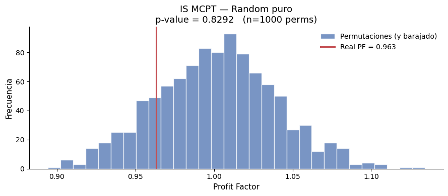{#fig-is-random}

Control negativo: el random no tiene señal. El PF real es 0.96 (ligeramente perdedor por azar) y cae cerca del centro de la distribución nula. Un p-value de 0.83 dice que no hay nada raro. Bajo $H_0$ el p-value es aproximadamente uniforme, así que cualquier valor entre 0 y 1 es esperable; 0.83 es nada más una realización particular del control negativo.

## In-Sample MCPT — curvas de equity

Los histogramas resumen la distribución del estadístico final (PF). Las curvas de equity, en cambio, muestran trayectorias completas del PnL acumulado: la corrida real en rojo y las 1,000 permutaciones en gris. La lectura visual es directa: si la curva roja se separa del abanico gris, hay señal; si se mete adentro o queda pegada, no hay señal distinguible.

### Oráculo

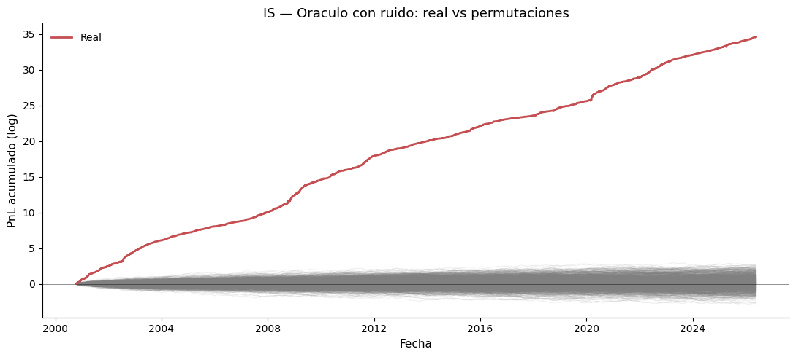{#fig-eq-is-oracle}

### LightGBM (overfit)

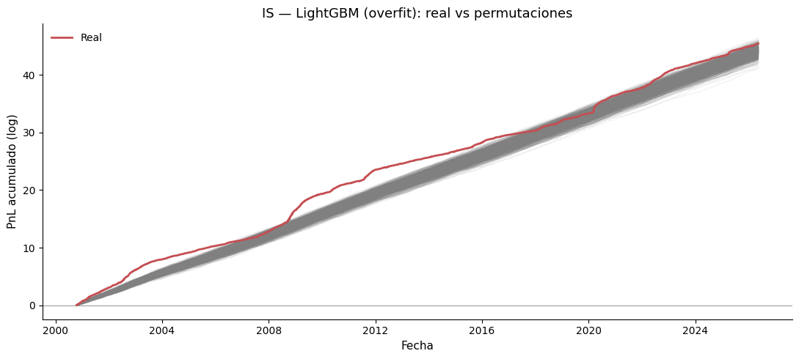{#fig-eq-is-lgbm}

El mensaje pedagógico que más nos importa: una curva de equity que sube limpiamente de 0 a 45 a lo largo de 26 años de "backtest" puede no significar absolutamente nada. Si el modelo es lo suficientemente flexible, cualquier $y$ permutada al azar produce algo equivalente.

### LightGBM clean

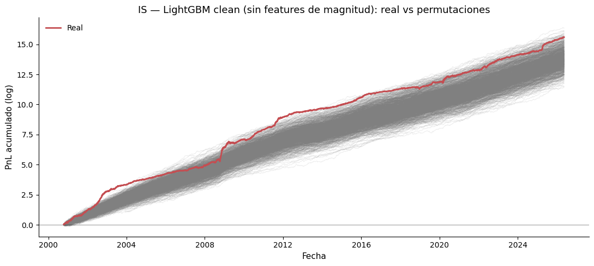{#fig-eq-is-lgbm-clean}

### Random

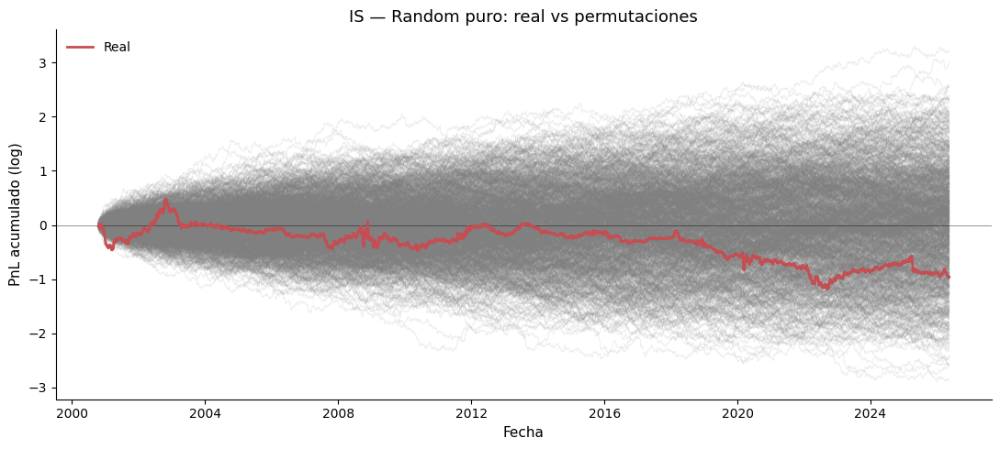{#fig-eq-is-random}

## Walk-Forward MCPT — histogramas

### Oráculo

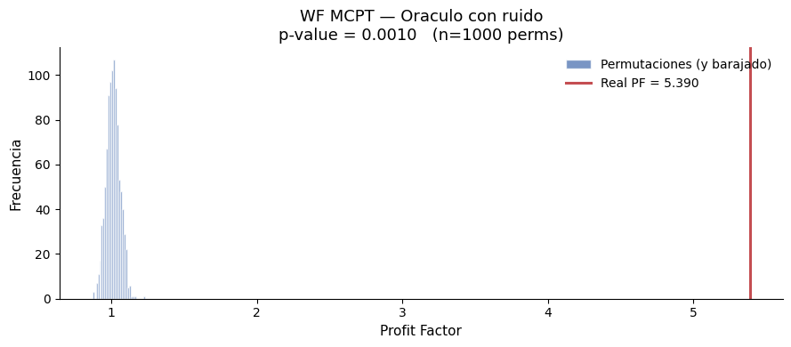{#fig-wf-oracle}

El oráculo, al ver la $y$ real en cada ventana, mantiene su ventaja también OOS. p-value mínimo.

### LightGBM (overfit), el resultado central del reporte

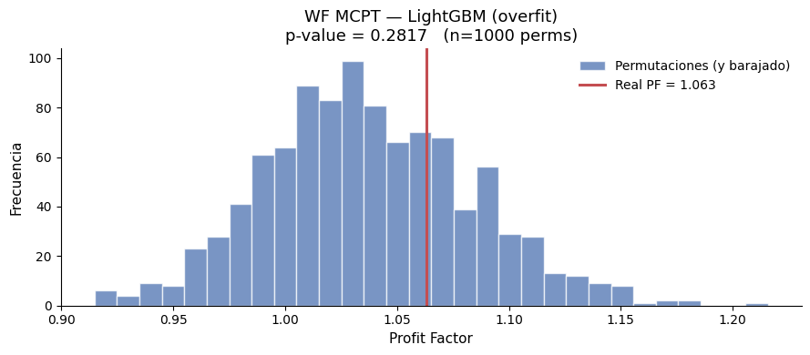{#fig-wf-lgbm}

Comparado con el de IS-LGBM, este histograma es la demostración empírica más limpia de overfitting que uno puede pedir. In-sample, LGBM producía PF de 16.9 (con permutaciones centradas en 14). En walk-forward, mismo modelo y mismas features, produce PF de 1.06 con permutaciones centradas en 1.04. Toda la "magia" del backtest era memorización de ruido. Cuando el modelo tiene que predecir el futuro, no hay nada que extraer.

Masters describe el patrón con precisión:

> "An overfitted trading system will perform well not only on the original data but on permuted data as well. […] Such systems produce astonishing performance in the training period and yet produce completely random trades out-of-sample."

### Random

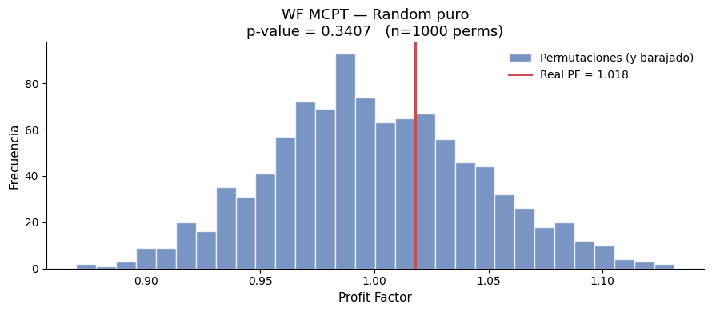{#fig-wf-random}

Sin sorpresa. El random sigue siendo random.

## Walk-Forward MCPT — curvas de equity

En estas gráficas, la línea vertical punteada marca el inicio del rango OOS (el final de la primera ventana de training, alrededor de 2008). Hasta ahí, todas las trayectorias son idénticas porque no se permuta; a partir de ese punto, el abanico se abre.

### Oráculo

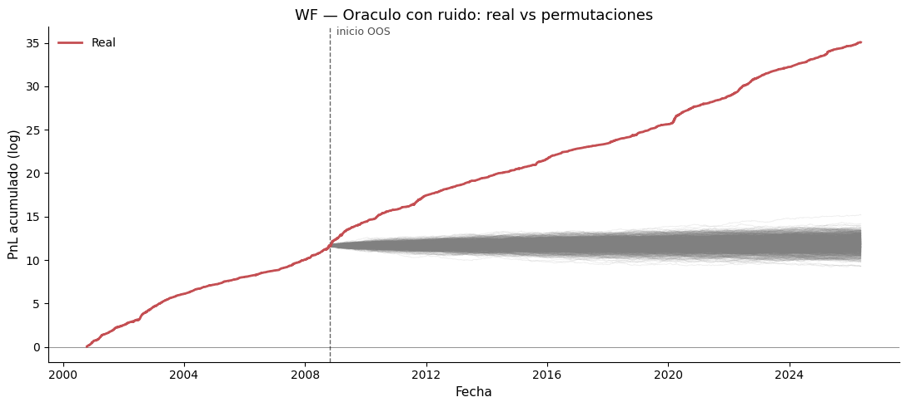{#fig-eq-wf-oracle}

### LightGBM

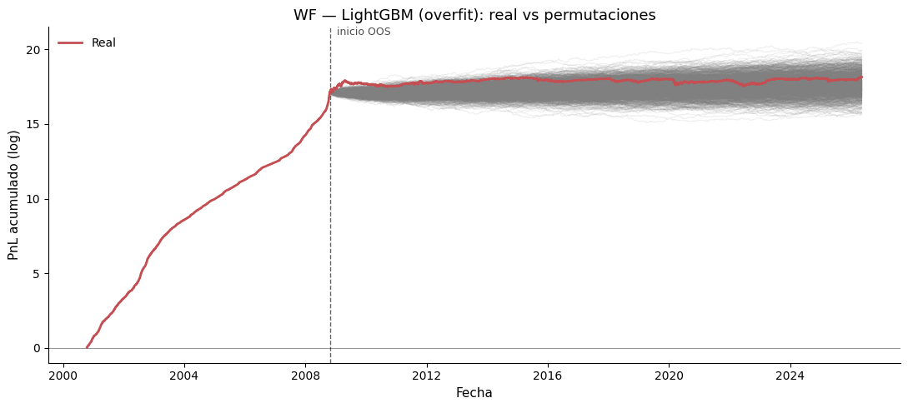{#fig-eq-wf-lgbm}

Probablemente sea la imagen más didáctica del reporte. La parte pre-OOS muestra cómo se vería un "backtest" tradicional sin walk-forward: PnL subiendo limpio de 0 a 17 a lo largo de 8 años. Una presentación vendiendo una estrategia con esa curva sería convincente. Pero apenas el modelo tiene que predecir el futuro, deja de haber diferencia con permutaciones aleatorias.

### Random

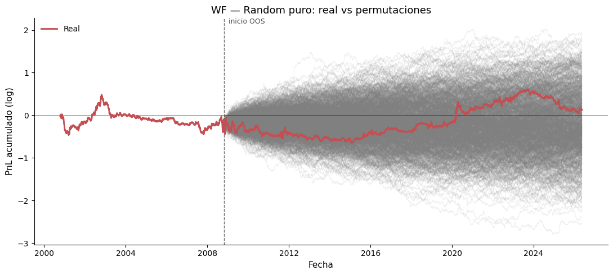{#fig-eq-wf-random}

## Discusión del sesgo IS-LGBM

El p-value IS de LGBM full (0.044) es bajo, pero no por la razón "buena" (señal genuina). Hay un sesgo que conviene explicar con cuidado.

Fuente del sesgo: features como `rvol_5d`, `rvol_21d` o `atr_norm_14d` correlacionan con $|r_{t+1}|$. Saben cuándo el mercado está volátil, aunque no sepan en qué dirección. Bajo Y-permutation, al barajar $(y, r)$, los retornos grandes se asocian con días en los que la volatilidad reciente podía ser cualquier cosa. En la corrida real, en cambio, los retornos grandes coinciden con días en los que la volatilidad reciente era genuinamente alta, y el modelo, sin necesidad de saber el signo, igual gana porque concentra sus posiciones (en cualquier dirección) en los días de retorno absoluto grande.

Eso rompe el supuesto de Masters de "*equal probability under $H_0$*": las permutaciones dejan de ser intercambiables con la realidad porque la correlación entre las features y $|r|$ es asimétrica.

La variante LGBM clean (sólo OHLC crudos, sin features de magnitud) saca la mayor parte de ese sesgo. Que el p-value de LGBM clean (0.018) siga siendo bajo en IS sugiere que LightGBM también encuentra alguna estructura en OHLC crudo, probablemente *serial dependencies* de cortísimo plazo. El WF se encarga de mostrar que esa estructura tampoco es explotable OOS.

# Conclusiones

## Hallazgos principales

1. El MCPT discrimina bien entre modelos con señal y sin señal. El oráculo obtiene p-values $< 0.01$ tanto IS como WF, y el random obtiene p-values dispersos en el rango medio, consistentes con $H_0$.

2. El MCPT in-sample detecta overfitting. LightGBM produce un PF in-sample de 16.9 (espectacular para un backtest tradicional), pero el promedio bajo permutación es 14: el modelo aprende ruido sobre cualquier $y$ que se le presente. El WF lo confirma: el mismo modelo cae a PF = 1.06 OOS, dentro de la distribución nula. Sin permutation testing, todo esto sería invisible.

3. Las features correlacionadas con la magnitud del retorno contaminan el Y-permutation test. Comparar LGBM (PF nulo $\approx 14$) contra LGBM clean (PF nulo $\approx 1.75$) pone número al sesgo. La implicación práctica es directa: la elección de features no es sólo un tema de poder predictivo, también lo es de correlación con $|r|$ si no queremos romper la validez del MCPT.

4. Walk-forward es el filtro definitivo. La caída de PF 16.9 a 1.06 entre IS y WF es la firma cuantitativa del sobreajuste.

## Respuesta a las preguntas iniciales

| Pregunta | Respuesta |
|---|---|
| ¿El MCPT IS detecta overfitting? | Sí, pero hay que mirar la distribución bajo $H_0$, no sólo el p-value. La distribución del LGBM bajo $H_0$ está centrada en 14, no en 1, y esa es la firma del overfitting. |
| ¿El MCPT WF detecta sistemas genuinos? | Sí. Oracle WF tiene p < 0.001; LGBM WF tiene p = 0.28. La separación es nítida. |
| ¿Bajo $H_0$ el p-value es uniforme? | Aproximadamente. Random IS = 0.83, WF = 0.34. Es una sola realización; para validarlo formalmente habría que repetir el experimento con muchas semillas. |
| ¿Las features de magnitud sesgan el test? | Sí. El sesgo es cuantificable y se elimina restringiendo features. |

## Limitaciones

- Una sola realización del control negativo (random). Para verificar formalmente la uniformidad del p-value bajo $H_0$, habría que repetir el experimento con varias `REAL_SEED`. Es caro computacionalmente.
- Y-permutation supone un target sin autocorrelación. El signo del log-return diario tiene autocorrelación cercana a cero, pero no exactamente cero, y en *timeframes* intradía el supuesto se puede romper.
- No estudiamos *selection bias* (Masters). Si hubiéramos probado muchos modelos y reportado sólo el mejor, los p-values de arriba serían optimistas. Lo evitamos fijando los tres modelos *a priori*.
- Un solo activo. Para generalizar a otros mercados habría que replicar.

## Trabajos futuros

- Repetir con permutación de precios al estilo Masters (sistemas de trading puros), en lugar de Y-permutation (modelos predictivos).
- *Bootstrap test* (Masters) para comparar p-values bajo distintas formulaciones.
- Extender al algoritmo con corrección por *selection bias* (Masters) para evaluar familias enteras de modelos.
- Permutación por fold (en lugar de global) en datos con regímenes claramente cambiantes.

# Referencias

- Masters, T. (2018). *Testing and Tuning Market Trading Systems: Algorithms in C++*. Apress. Capítulo 7: "Permutation Tests".
- Aronson, D. (2007). *Evidence-Based Technical Analysis*. Wiley.
- Ke, G. et al. (2017). "LightGBM: A Highly Efficient Gradient Boosting Decision Tree". *NeurIPS*.
- Yahoo Finance: datos OHLCV de SPY, vía la librería `yfinance`.

# Anexo de código

Todo el código corre en Python 3.11 con `conda run -n rappi`. Las dependencias relevantes:

```
numpy        >= 1.26
pandas       >= 2.0
yfinance     >= 0.2
lightgbm     >= 4.0
matplotlib   >= 3.8
seaborn      >= 0.13
joblib       >= 1.3
tqdm         >= 4.66
```

## Configuración

```python
import warnings; warnings.filterwarnings('ignore')
import numpy as np, pandas as pd, yfinance as yf
import matplotlib.pyplot as plt, seaborn as sns
from lightgbm import LGBMClassifier
from tqdm.auto import tqdm
from joblib import Parallel, delayed

RNG_SEED     = 67
N_PERM       = 1000
TRAIN_WINDOW = 252 * 8       # 8 años
WF_STEP      = 252 * 3       # 3 años (6 folds OOS)
ORACLE_NOISE = 1.0
N_JOBS       = 8
REAL_SEED    = 7

np.random.seed(RNG_SEED)
```

## Descarga de datos

```python
spy = yf.download('SPY', start='2000-01-01', auto_adjust=True, progress=False)
if isinstance(spy.columns, pd.MultiIndex):
    spy.columns = spy.columns.droplevel(1)
spy.columns = [c.capitalize() for c in spy.columns]
```

## Función de Profit Factor

```python
def profit_factor(signal: pd.Series, log_ret: pd.Series) -> float:
    pnl = signal.values * log_ret.values
    pnl = pnl[~np.isnan(pnl)]
    wins = pnl[pnl > 0].sum()
    loss = np.abs(pnl[pnl < 0].sum())
    return wins / loss if loss > 1e-10 else float('inf')
```

## In-sample MCPT (completo)

```python
def _permute_pair(y, ret, seed):
    rng = np.random.default_rng(seed)
    idx = rng.permutation(len(y))
    return (pd.Series(y.values[idx],   index=y.index),
            pd.Series(ret.values[idx], index=ret.index))

def run_is_mcpt(model_name, X, y, log_ret, n_perm=N_PERM,
                n_jobs=N_JOBS, real_seed=REAL_SEED):
    def _signal(y_for_training, seed):
        if model_name == 'oracle':
            return predict_oracle(y, seed=seed)
        elif model_name in ('lgbm', 'lgbm_clean'):
            return predict_lgbm(train_lgbm(X, y_for_training), X)
        elif model_name == 'random':
            return predict_random(X, seed=seed)

    def _one_perm(seed):
        y_perm, ret_perm = _permute_pair(y, log_ret, seed)
        sig = _signal(y_perm, seed)
        return profit_factor(sig, ret_perm)

    real_pf = profit_factor(_signal(y, real_seed), log_ret)

    perm_pfs = Parallel(n_jobs=n_jobs, backend='loky')(
        delayed(_one_perm)(s) for s in range(1, n_perm + 1)
    )
    perm_pfs = np.array([pf for pf in perm_pfs if np.isfinite(pf)])
    k     = int((perm_pfs >= real_pf).sum())
    p_val = (k + 1) / (len(perm_pfs) + 1)
    return {'real_pf': real_pf, 'perm_pfs': perm_pfs, 'p_value': p_val}
```

## Walk-Forward MCPT (completo)

```python
def _wf_signal_for_window(model_name, X_tr, y_tr_for_training,
                          y_real_window, X_win, seed):
    if model_name == 'oracle':
        return predict_oracle(y_real_window, seed=seed)     # ve y real
    elif model_name == 'lgbm':
        return predict_lgbm(train_lgbm(X_tr, y_tr_for_training), X_win)
    elif model_name == 'random':
        return predict_random(X_win, seed=seed)

def _wf_one(model_name, X, y, log_ret, y_used, ret_used, real_seed=REAL_SEED):
    n = len(X); signals = []; rets_eval = []

    # Train inicial (común a todas las permutaciones)
    X_init       = X.iloc[:TRAIN_WINDOW]
    y_init_real  = y.iloc[:TRAIN_WINDOW]
    y_init_train = y_used.iloc[:TRAIN_WINDOW]
    ret_init     = ret_used.iloc[:TRAIN_WINDOW]
    signals.append(_wf_signal_for_window(
        model_name, X_init, y_init_train, y_init_real, X_init, real_seed))
    rets_eval.append(ret_init)

    # Folds OOS
    for start in range(TRAIN_WINDOW, n, WF_STEP):
        end       = min(start + WF_STEP, n)
        X_tr      = X.iloc[start - TRAIN_WINDOW : start]
        y_tr      = y_used.iloc[start - TRAIN_WINDOW : start]
        X_te      = X.iloc[start : end]
        y_te_real = y.iloc[start : end]
        r_te      = ret_used.iloc[start : end]
        sig = _wf_signal_for_window(
            model_name, X_tr, y_tr, y_te_real, X_te, real_seed + start)
        signals.append(sig); rets_eval.append(r_te)

    return pd.concat(signals), pd.concat(rets_eval)

def _wf_one_perm(seed, model_name, X, y, log_ret):
    y_used   = y.copy()
    ret_used = log_ret.copy()
    rng      = np.random.default_rng(seed)
    idx      = rng.permutation(len(y) - TRAIN_WINDOW)
    y_used.iloc[TRAIN_WINDOW:]   = y.iloc[TRAIN_WINDOW:].values[idx]
    ret_used.iloc[TRAIN_WINDOW:] = log_ret.iloc[TRAIN_WINDOW:].values[idx]

    sig, ret = _wf_one(model_name, X, y, log_ret, y_used, ret_used)
    sig_oos = sig.iloc[TRAIN_WINDOW:]
    ret_oos = ret.iloc[TRAIN_WINDOW:]
    valid   = ret_oos.notna()
    return profit_factor(sig_oos[valid], ret_oos[valid])

def run_wf_mcpt(model_name, X, y, log_ret, n_perm=N_PERM,
                n_jobs=N_JOBS, real_seed=REAL_SEED):
    sig_real, ret_real = _wf_one(model_name, X, y, log_ret, y, log_ret, real_seed)
    sig_oos = sig_real.iloc[TRAIN_WINDOW:]
    ret_oos = ret_real.iloc[TRAIN_WINDOW:]
    valid   = ret_oos.notna()
    real_pf = profit_factor(sig_oos[valid], ret_oos[valid])

    perm_pfs = Parallel(n_jobs=n_jobs, backend='loky')(
        delayed(_wf_one_perm)(s, model_name, X, y, log_ret)
        for s in range(1, n_perm + 1)
    )
    perm_pfs = np.array([pf for pf in perm_pfs if np.isfinite(pf)])
    k     = int((perm_pfs >= real_pf).sum())
    p_val = (k + 1) / (len(perm_pfs) + 1)
    return {'real_pf': real_pf, 'perm_pfs': perm_pfs, 'p_value': p_val}
```

## Notebook completo

El notebook con todo el código ejecutable está en `mcpt_calibration.ipynb`. La simulación tarda del orden de 2 o 3 horas en una máquina con 8 cores. Para reproducir los resultados:

```bash
conda run -n rappi jupyter nbconvert --to notebook --execute mcpt_calibration.ipynb
```

Las semillas (`RNG_SEED=67`, `REAL_SEED=7`) dan reproducibilidad *bit-exact* de la corrida real. Las permutaciones usan semillas $1, 2, \dots, m$ vía `np.random.default_rng(seed)`, así que también son reproducibles.
